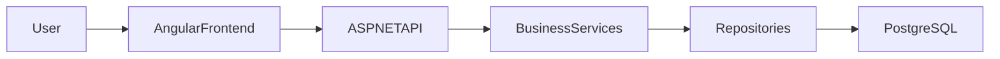
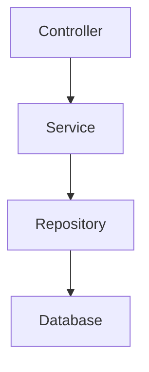
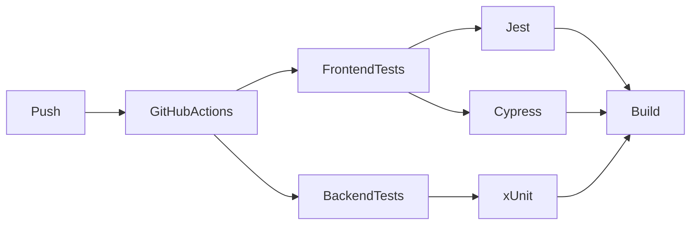
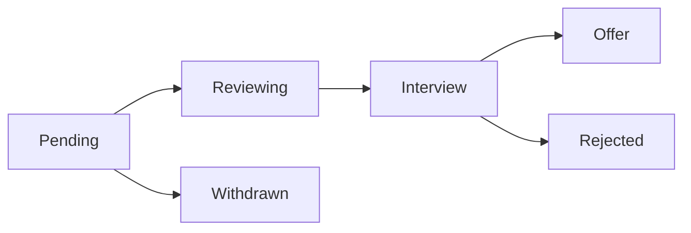
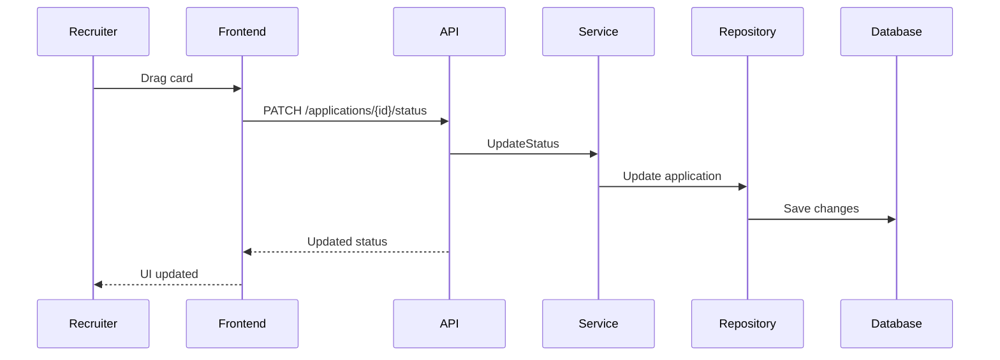
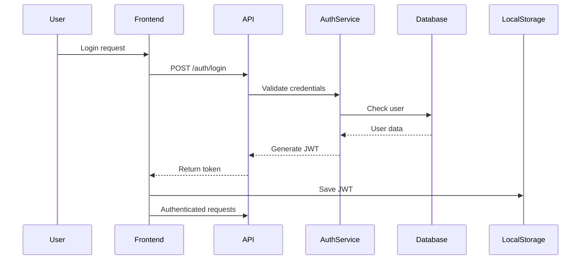

RecruitFlow


RecruitFlow est une plateforme moderne de gestion du recrutement permettant aux entreprises de gérer leur pipeline de recrutement de manière visuelle.

Fonctionnalités principales :

gestion des offres d’emploi
suivi des candidatures
pipeline de recrutement en kanban
gestion des entrevues
dashboard analytique

Le projet implémente une architecture full-stack moderne avec Angular + ASP.NET Core, accompagnée de tests automatisés et CI/CD.

Architecture du système

Architecture Backend (Clean Architecture)

Responsabilités des couches :

## Responsabilités des couches

| Couche | Responsabilité |
|--------|----------------|
| API | endpoints HTTP |
| Services | logique métier |
| Repositories | accès données |
| Core | entités et interfaces |


## Structure du projet

```text
RecruitFlow
│
├── recruit-flow-front
│   Angular application
│
├── RecruitFlow.API
│   ASP.NET Core Web API
│
├── RecruitFlow.Core
│   Domain entities + interfaces
│
├── RecruitFlow.Infrastructure
│   Repositories + services
│
└── RecruitFlow.Tests
    Backend unit tests
```

## Stack technologique

### Frontend

- Angular 19
- Angular Material
- RxJS
- SCSS

### Backend

- ASP.NET Core 8
- Entity Framework Core
- PostgreSQL
- JWT Authentication
- Swagger

### Tests

- Jest
- Cypress
- xUnit
- Moq
## CI/CD Pipeline


Chaque push déclenche automatiquement :

Frontend

installation dépendances
tests unitaires Jest
build Angular
tests E2E Cypress

Backend

restore
build
tests xUnit
Pipeline de recrutement
## Recruitment Pipeline


Chaque candidature évolue dans ce pipeline.

Les recruteurs peuvent déplacer les candidatures via drag & drop dans le kanban.

Flow technique Drag & Drop

## Flow Authentification JWT


Qualité logicielle

Le projet utilise plusieurs niveaux de tests.

Tests Frontend (Unit)
npm run test

Framework :

Jest
Tests End-to-End
npx cypress run

Scénarios testés :

login
création d’offre
navigation application
drag & drop kanban
Tests Backend
dotnet test

Frameworks :

xUnit
Moq

Les tests couvrent :

logique métier des services
validations métier
gestion erreurs
Installation locale
Cloner le projet
git clone https://github.com/USERNAME/recruitflow.git
cd recruitflow
Backend
cd RecruitFlow.API

dotnet restore

dotnet ef database update

dotnet run

API disponible :

http://localhost:5072

Swagger :

http://localhost:5072/swagger
Frontend
cd recruit-flow-front

npm install

npm start

Application :

http://localhost:4200
Sécurité
JWT authentication
validation backend
protection endpoints
séparation logique métier / accès données
Améliorations futures
notifications temps réel
tri intelligent des candidatures
analytics recrutement
intégration email
application mobile
Auteur

Seydi Ahmeth Ndiaye

Étudiant en informatique — UQTR

Technologies principales :

Angular
ASP.NET Core
PostgreSQL
Licence

Projet éducatif / portfolio.
